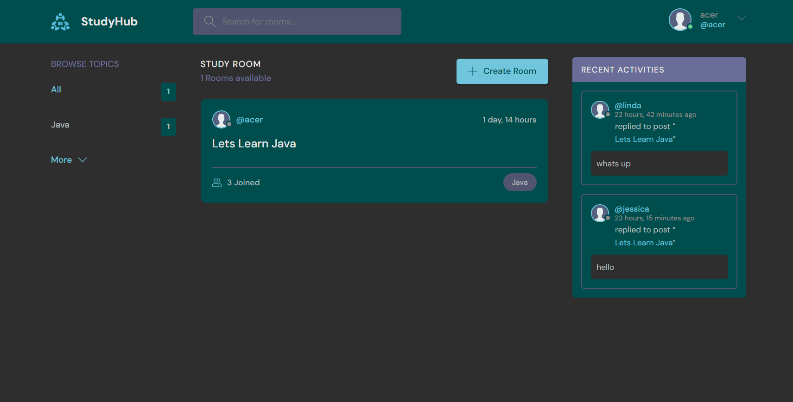

# StudyHub

Study hub is a platform designed to bring people together from around the world to study, share ideas, and collaborate on different topics.  
Whether you're learning a new language, preparing for exams, or just want to exchange knowledge, Study hub makes it easy to find study partners and grow together.

## Features
- Connect with study partners worldwide
- Join or create study groups based on your interests
- Share and discuss ideas across various topics
- Real-time chat and collaboration tools
- User profiles and topic-specific forums

## Clone the repository using the command below:
git clone https://github.com/bongiwemvuni/Study_hub.git

### Move into the project directory
cd STUDY_HUB

### Create a virtual environment
pip install virtualenv
virtualenv envname

### Activate the virtual environment
#### Windows
envname\Scripts\activate
#### Linux/Mac
source envname/bin/activate

## Install the required packages
pip install -r requirements.txt

## Running the App
python manage.py runserver

# Preview 

 

 

